# Enfoque arquitectónico

| Elemento | Descripción aplicada al Marketplace |
|---|---|
| Patrón / enfoque arquitectónico | Clean Architecture (Arquitectura Limpia). |
| Objetivo | Separar responsabilidades y controlar las dependencias hacia el dominio. |
| ¿Qué problema resuelve? | Evita el acoplamiento entre la interfaz Angular, las reglas del negocio y las tecnologías externas, como bases de datos, API y servicios de pago. |
| Capas definidas | Presentación, Aplicación, Dominio e Infraestructura. |
| Beneficios | • Facilita el mantenimiento y las pruebas unitarias. • Permite cambiar implementaciones técnicas sin modificar innecesariamente las reglas del negocio. • Mejora la organización y separación de responsabilidades del código. |

## Diagrama de Clean Architecture

```mermaid
flowchart TB
    USER(["<b>Usuario</b><br/>(Cliente)"])

    subgraph APP["«aplicación» Marketplace Web · Angular 18 · TypeScript · src/app/"]
        subgraph ADAP["ADAPTADORES Y FRAMEWORKS — dependen de Angular, HttpClient, RxJS"]

            subgraph PRES["PRESENTACIÓN<br/>src/app/presentacion/"]
                CAT["«componente»<br/><b>CatalogoComponent</b><br/>lista y filtra productos"]
                EST["«servicio de estado»<br/><b>EstadoCarrito</b><br/>signals · sin reglas"]
                CAR["«componente»<br/><b>CarritoComponent</b><br/>resumen y confirmar compra"]
                APPC["«componente»<br/><b>AppComponent</b><br/>shell de la aplicación"]
            end

            subgraph APL["APLICACIÓN — casos de uso · src/app/aplicacion/"]
                UC1["«caso de uso»<br/><b>ConsultarCatalogoCasoUso</b><br/>ejecutar()"]
                UC2["«caso de uso»<br/><b>AgregarAlCarritoCasoUso</b><br/>ejecutar()"]
                UC3["«caso de uso»<br/><b>RegistrarCompraCasoUso</b><br/>ejecutar()"]

                subgraph DOM["DOMINIO — núcleo · src/app/dominio/"]
                    subgraph MOD["Modelos (entidades y reglas)"]
                        PROD["«entidad»<br/><b>Producto</b><br/>stock, categoría, precio"]
                        CARR["«entidad»<br/><b>Carrito</b><br/>inmutable · subtotal, total"]
                        PED["«entidad»<br/><b>Pedido</b><br/>estados · cancelación"]
                        PREC["«reglas»<br/><b>precios.ts</b><br/>comisión 10 % · IGV 18 %"]
                    end
                    subgraph CON["Contratos (puertos)"]
                        RP["«interface»<br/><b><i>RepositorioProductos</i></b>"]
                        RPE["«interface»<br/><b><i>RepositorioPedidos</i></b>"]
                        PP["«interface»<br/><b><i>ProcesadorPagos</i></b>"]
                        NC["«interface»<br/><b><i>NotificadorCliente</i></b>"]
                    end
                end
            end

            subgraph INF["INFRAESTRUCTURA<br/>src/app/infraestructura/"]
                A1["«adaptador»<br/>RepositorioProductosMemoria<br/>RepositorioProductosHttp"]
                A2["«adaptador»<br/>RepositorioPedidosMemoria"]
                A3["«adaptador»<br/>ProcesadorPagosSimulado<br/>ProcesadorPagosNubiz"]
                A4["«adaptador»<br/>NotificadorConsola<br/>NotificadorWhatsApp"]
                TOK["«Angular DI»<br/><b>tokens.ts</b><br/>InjectionToken por contrato"]
            end
        end

        COMP["«raíz de composición»<br/><b>app.config.ts</b><br/>único archivo que elige qué adaptador cumple cada contrato (useFactory + InjectionToken) y lo inyecta en los casos de uso"]
    end

    API["«sistema externo»<br/><b>Marketplace API REST</b><br/>Backend Node.js · monolito modular<br/>/api/productos · /api/pedidos<br/>/api/authorization · /api/mensajes<br/>Se integra con Nubiz y WhatsApp;<br/>las credenciales viven solo aquí."]

    USER -->|navegador| CAT
    CAT -->|invoca| UC1
    EST -.-> CARR
    UC1 -.-> RP
    UC2 -.-> CARR
    UC3 -.-> PP
    A1 -.->|implementa| RP
    A2 -.-> RPE
    A3 -.-> PP
    A4 -.-> NC
    A1 -->|HTTP/JSON| API
    A3 --> API
    A4 --> API
    COMP -.->|registra| TOK

    linkStyle 6,7,8,9 stroke:#7e57c2,stroke-width:1.5px,stroke-dasharray:4 3

    style APP fill:#ffffff,stroke:#333,stroke-dasharray:6 4
    style ADAP fill:#f5f5f5,stroke:#999
    style PRES fill:#e4ebf8,stroke:#6c8ebf
    style APL fill:#e3f0dc,stroke:#82b366
    style DOM fill:#fff2cc,stroke:#d6b656
    style MOD fill:#fff2cc,stroke:#d6b656
    style CON fill:#fff2cc,stroke:#d6b656
    style INF fill:#efe4f7,stroke:#9673a6

    classDef pres fill:#ffffff,stroke:#6c8ebf,color:#000
    classDef uc fill:#ffffff,stroke:#82b366,color:#000
    classDef dom fill:#ffffff,stroke:#d6b656,color:#000
    classDef inf fill:#ffffff,stroke:#9673a6,color:#000
    classDef ext fill:#eeeeee,stroke:#666,color:#000

    class CAT,EST,CAR,APPC pres
    class UC1,UC2,UC3 uc
    class PROD,CARR,PED,PREC,RP,RPE,PP,NC dom
    class A1,A2,A3,A4,TOK,COMP inf
    class API ext
```

## Leyenda

- Flecha continua: llamada en tiempo de ejecución.
- Flecha punteada: dependencia de código (import), siempre apunta hacia el centro.
- Flecha punteada violeta: implementa el contrato definido en el dominio (inversión de dependencia).
- Anillos: Dominio ⊂ Aplicación ⊂ Adaptadores y frameworks.

## Regla de dependencia

1. El dominio no importa nada de las capas externas.
2. Los casos de uso solo conocen entidades y contratos.
3. Los adaptadores implementan contratos; son intercambiables.
4. Cambiar de tecnología = cambiar app.config.ts, no el dominio.