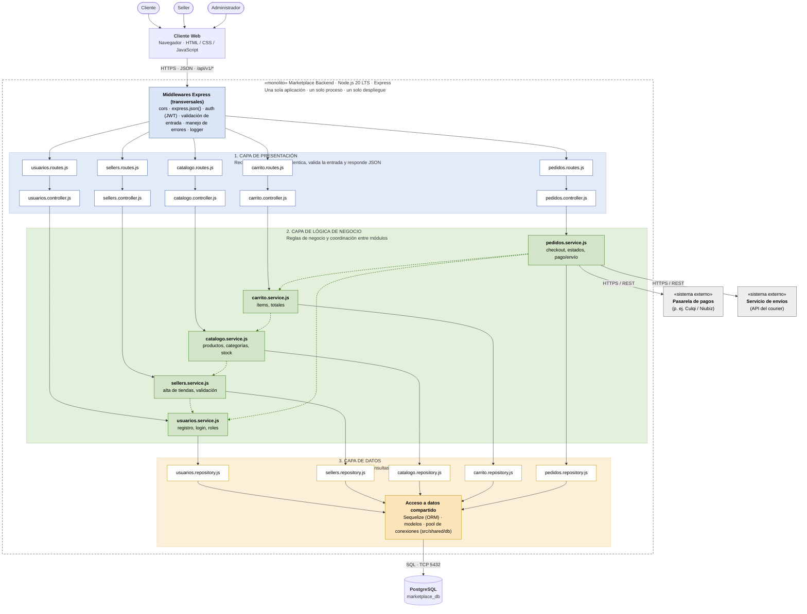

## Diagrama de arquitectura

# Estilo arquitectónico

**Estilo seleccionado:** Monolito modular con arquitectura en capas.

Todo el backend se ejecuta como una sola aplicación (un solo proceso y un solo despliegue), organizada en módulos independientes y en tres capas: presentación, lógica de negocio y datos. Esta decisión responde a los drivers DA01 (Escalabilidad) y DA06 (Mantenibilidad), y está registrada en ADR-001.

## Reglas de la arquitectura

1. Cada capa solo invoca a la capa inmediatamente inferior.
2. Un módulo no accede al repository ni a las tablas de otro módulo.
3. La comunicación entre módulos se hace llamando a su service.
4. Todo se ejecuta en un único proceso Node.js con una única base de datos.